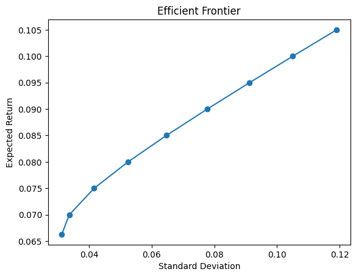

# Mean-Variance-Optimization-and-Efficient-Frontier

A small, reproducible Python toolkit for **mean–variance portfolio optimization**
and **efficient frontier** analysis.

The project is designed as a lightweight research and experimentation framework,
with an emphasis on clarity, modularity, and reproducibility.

---

## Key Features

- Clean, modular pipeline:
  - data → statistics → optimization → outputs
- Reproducible results via scripts and notebooks
- Flexible constraint design:
  - long-only or short-selling portfolios
  - easy extension to bounded weights or leverage constraints
- Efficient frontier generation and visualization

---

## What You Can Do with This Repo

- Load return data and build a consistent analytics pipeline
- Compute:
  - arithmetic and geometric mean returns
  - covariance matrix
  - portfolio expected return and volatility
- Solve mean–variance optimization (MVO) problems
- Generate:
  - portfolio allocation tables (weights)
  - risk/return summary tables
  - efficient frontier plots

---

## Efficient Frontier Example

The figure below shows an example efficient frontier generated by the toolkit.
Each point corresponds to a minimum-variance portfolio for a given target return.


---

## Repository Structure

```text
mvo-lab/
├─ mvo/        # Core library code: statistics, optimization, and utilities
├─ code/       # Example scripts and experimental code
├─ assets/     # Images and figures used in documentation
└─ data/       # Optional datasets (kept local if needed)
